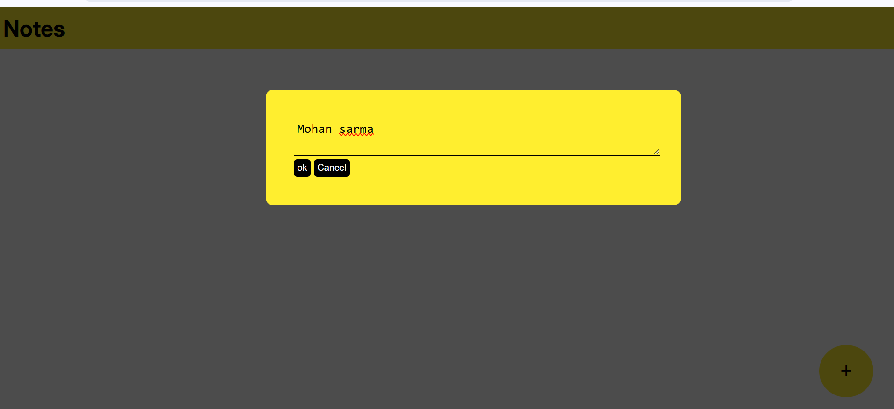
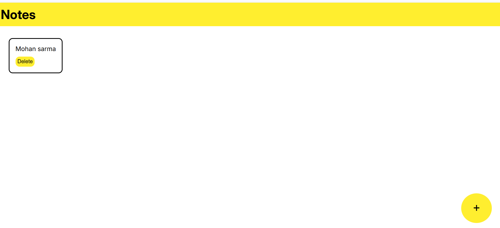

# notes-app
 A notes app using localstorage
# 📝 Notes App 

A clean and simple Notes App built using **HTML, CSS, and JavaScript**.

 Features:
- Add notes using a popup
- Delete individual notes
- Notes are saved using `localStorage` (they stay after refresh!)
- Fully responsive and mobile-friendly layout

Technologies Used:

- HTML5
- CSS3
- JavaScript (DOM + localStorage)

🔗 Live Demo:
[Click here](https://smohansarma.neocities.org/notes/)

📁 How to Use
1. Click “Add Note” button
2. Enter your note and save
3. View and delete notes anytime
4. Notes will persist until deleted manually

## 📸 Screenshot

Made by **Mohan Sarma**

